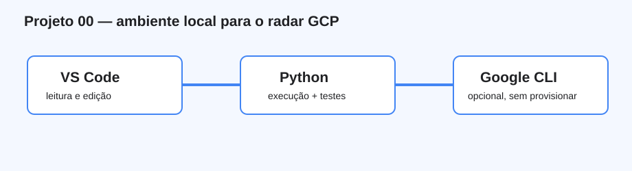

# Projeto 00 — Configuração do ambiente GCP

> Faça este projeto antes dos projetos `001` em diante. Ele prepara somente o ambiente local e não cria recursos Google Cloud.



## O que você aprenderá

Instalar e verificar VS Code, Python e Git; trabalhar com `.venv`; executar módulos e testes; reconhecer `gcloud` e `bq` como ferramentas opcionais e manter credenciais fora dos projetos.

## Ferramentas, bibliotecas e recursos utilizados

| Item | Obrigatório? | Função | Verificação |
|---|---:|---|---|
| VS Code | Recomendado | Editor, terminal e documentação | `code --version` |
| Python extension | Recomendado | Interpretador e testes no VS Code | Extensions → Python (Microsoft) |
| Python 3.10+ | Sim | Execução local | `python3 --version` |
| `venv`/`pip` | Quando houver dependências | Isolamento de bibliotecas | `python3 -m pip --version` |
| Git | Recomendado | Revisão local sem publicação automática | `git --version` |
| Google Cloud CLI | Não | Fornece `gcloud` e componentes opcionais | `gcloud version` |
| `bq` | Não | CLI do BigQuery para projetos que a expliquem | `bq version` |
| Cloud Code | Não | Integração opcional no VS Code | Extensions → Cloud Code |

## Passo a passo detalhado

1. Instale o [VS Code](https://code.visualstudio.com/Download) e a extensão `Python` da Microsoft. Cloud Code é opcional.
2. Em **Terminal → New Terminal**, confirme:

```bash
python3 --version
git --version
```

3. Abra a pasta correta:

```bash
cd "caminho/para/gcp-data-engineering-projects"
code .
cd 000-configuracao-ambiente
```

4. Crie o ambiente virtual:

```bash
python3 -m venv .venv
source .venv/bin/activate
python3 -m pip install --upgrade pip
```

5. Execute a checagem e o teste:

```bash
python3 -m src.check_environment
python3 -m unittest discover -s tests -v
cat data/output/environment.json
```

O Python deve estar suportado. `gcloud` e `bq` podem estar ausentes porque os projetos priorizam execução local.

6. Se um projeto futuro exigir Google Cloud CLI, use somente o [guia oficial](https://cloud.google.com/sdk/docs/install). `gcloud auth application-default login` cria credenciais locais e nunca deve ter seu arquivo copiado para o repositório.

## Site local com MkDocs

**MkDocs** converte Markdown em site, e **Material for MkDocs** fornece navegação, busca e cópia de código. São ferramentas opcionais, gratuitas e locais.

```bash
cd "caminho/para/gcp-data-engineering-projects"
source .venv/bin/activate
python3 -m pip install -r requirements-docs.txt
python3 -m mkdocs serve --config-file mkdocs.yml
```

Abra a URL indicada e use `Ctrl+C` para encerrar. Para gerar HTML sem publicar: `python3 -m mkdocs build --strict --config-file mkdocs.yml`. A saída fica em `site-local/GCP` e é ignorada pelo Git. Se MkDocs não for encontrado, ative a `.venv` da raiz e reinstale `requirements-docs.txt`.

## Conceitos de Engenharia de Dados aplicados

Ambiente reproduzível, dependências isoladas, local-first, Application Default Credentials e validação automatizada.

## Pré-requisitos e possíveis custos

Computador com terminal. As ferramentas locais são gratuitas. BigQuery, Dataflow e outros serviços podem cobrar; este projeto não usa projeto GCP ou billing account.

## O que foi validado

O checker registra apenas versões e disponibilidade de executáveis, sem ler projeto, conta ou token. Um teste valida a estrutura.

## Pratique e registre evidência

Execute o checker, anote Python e ferramentas opcionais encontradas, reabra o terminal, reative `.venv` e confirme que o teste continua em `OK`.

## Solução de problemas

| Sintoma | Correção |
|---|---|
| `python3` ausente | Instale Python e reabra o terminal |
| `code` ausente | Command Palette → “Shell Command: Install 'code' command” |
| `No module named src` | Entre em `000-configuracao-ambiente` antes de executar |
| `.venv` não aparece | Execute `source .venv/bin/activate` |
| `gcloud`/`bq` ausente | Continue localmente ou instale quando o projeto exigir |
| CLI solicita billing | Pare; este projeto não autoriza criar ou vincular recursos |

## Checklist de conclusão

- [ ] Abri GCP no VS Code e selecionei a `.venv`.
- [ ] Executei checker e teste.
- [ ] Entendi que `gcloud`, `bq` e Cloud Code são opcionais.
- [ ] Não salvei credenciais nem ativei serviços.
- [ ] Não publiquei nem executei `git push`.

## Tecnologias relacionadas ainda não utilizadas

Sem projeto GCP, billing, SDK Python, service account key, Terraform, Docker, deploy ou CI/CD.

## Referências oficiais

- [Primeiros passos no VS Code](https://code.visualstudio.com/docs/getstarted/getting-started)
- [Python no VS Code](https://code.visualstudio.com/docs/python/python-tutorial)
- [Ambientes virtuais](https://docs.python.org/3/library/venv.html)
- [Instalar Google Cloud CLI](https://cloud.google.com/sdk/docs/install)
- [Application Default Credentials](https://cloud.google.com/docs/authentication/provide-credentials-adc)

Rascunho local; nada foi publicado.
